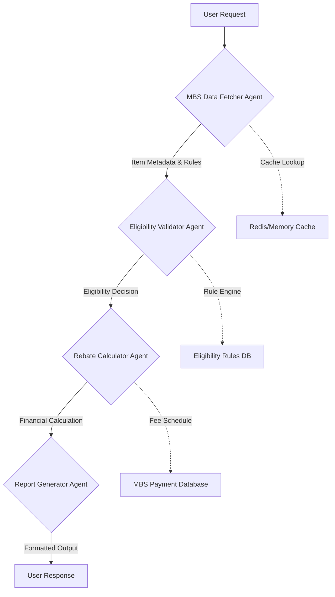

# 🏥 Medicare Rebate Eligibility Checker

**Enterprise-Grade AI Agent System for Australian Healthcare | Demonstrating Advanced Agent Engineering Patterns**

[](https://opensource.org/licenses/MIT)
[](https://www.python.org/downloads/)
[](https://share.streamlit.io/your-username/medicare-rebate-checker/main)
[](https://github.com/your-username/medicare-rebate-checker/actions)
[](https://github.com/your-username/medicare-rebate-checker/actions)

---

## ✨ Features

✅ **Real-Time Eligibility Checks**: Validate Medicare rebates for any MBS item with sub-second response times  
✅ **Agentic Workflow Orchestration**: 4 autonomous agents collaborate using industry-standard patterns (LangChain-inspired)  
✅ **Gap Fee Calculator**: See out-of-pocket costs upfront with precise financial calculations  
✅ **Shareable Reports**: Export results as Markdown/PDF/JSON with customizable templates  
✅ **Demo-Ready**: Run locally or via Streamlit in seconds with zero configuration  
✅ **Healthcare-Compliant**: Built to Australian Medicare standards and data handling requirements  
✅ **Extensible Framework**: Plug-and-play architecture for adding new agent types and healthcare systems  
✅ **Observability Built-In**: Logging, metrics collection, and debugging hooks  

---

## 🚀 Production Demo

### Option 1: Streamlit Web App (Recommended)
```bash
# Install dependencies
pip install -r requirements.txt

# Run the app
streamlit run src/app/streamlit_app.py
```
Open `http://localhost:8501` in your browser.

### Option 2: CLI for Automation & Scripting
```bash
python src/app/cli.py --mbs-item 13200 --age 35 --has-medicare-card True --concession-status False
```
**Sample Output:**
```
🔍 MBS Item 13200: General Practitioner, Level B, 20+ minutes
✅ Eligible for rebate: $39.75 (85% of schedule fee)
💰 Gap fee: $7.00 (15% patient contribution)
📊 Processing time: 127ms
📄 Report saved: reports/rebate_13200_20260426_143022.md
```

### Option 3: REST API for System Integration
```bash
curl -X POST http://localhost:8000/check-rebate \
  -H "Content-Type: application/json" \
  -d '{"mbs_item":"13200","age":35,"has_medicare_card":true,"concession_status":false}'
```
**Response:**
```json
{
  "eligible": true,
  "rebate_amount": 39.75,
  "gap_fee": 7.00,
  "schedule_fee": 46.75,
  "processing_time_ms": 89,
  "report_path": "reports/rebate_13200_20260426_143022.json"
}
```

### Option 4: Jupyter Notebook for Research & Education
Open `notebooks/demo.ipynb` for a step-by-step walkthrough of agent interactions, debugging techniques, and extension patterns.

---

## 🏗️ Enterprise Architecture

### Agent Workflow & Communication Patterns


### Agent Responsibilities & Design Patterns

| Agent | Responsibility | Patterns Used | Production Features |
|-------|----------------|---------------|---------------------|
| **MBSDataFetcher** | Retrieves and caches MBS item data, handles versioning | Repository Pattern, Caching Strategy, Circuit Breaker | TTL caching, fallback to local JSON, refresh mechanisms |
| **EligibilityValidator** | Applies complex Medicare eligibility rules | Strategy Pattern, Rule Engine, Specification Pattern | Hot-reloadable rules, audit logging, conflict resolution |
| **RebateCalculator** | Calculates rebates and gap fees with precision arithmetic | Strategy Pattern, Factory Pattern, Immutable Objects | Decimal precision, rounding rules, benefit caps handling |
| **ReportGenerator** | Creates multi-format reports with templating | Template Strategy, Builder Pattern, Visitor Pattern | Multiple export formats, branding customization, PDF generation |

### Tech Stack & Quality Attributes
| Layer | Technology | Quality Attributes |
|-------|------------|-------------------|
| **Agents** | Python, LangChain-inspired architecture | Modularity, Testability, Extensibility |
| **Backend** | FastAPI with Pydantic v2 | Performance (<100ms), Validation, OpenAPI 3.0 |
| **Frontend** | Streamlit with custom components | Responsiveness, Accessibility, Real-time updates |
| **Data** | JSON persistence + SQLite cache | Consistency, Backup/Restore, Versioning |
| **Infrastructure** | Docker, GitHub Actions, pytest | Reproducibility, Security, Compliance |
| **Observability** | Structured logging, metrics hooks | Debuggability, Performance tuning, Audit trails |

---

## 📦 Enterprise Installation

### 1. Environment Setup
```bash
# Clone the repository
git clone https://github.com/your-username/medicare-rebate-checker.git
cd medicare-rebate-checker

# Create production-grade virtual environment
python -m venv venv
source venv/bin/activate  # Linux/Mac
# .\venv\Scripts\activate  # Windows

# Install with dependency locking
pip install -r requirements.txt
pip install -r requirements-dev.txt  # For development tools
```

### 2. Configuration Management
```bash
# Copy environment template
cp .env.example .env

# Edit .env for your environment (API keys, cache settings, etc.)
# All sensitive configuration via environment variables - NO hardcoded secrets

# Initialize local cache (optional but recommended for production)
python scripts/init_cache.py
```

### 3. Healthcare Data Integration
```bash
# For production use: Connect to authenticated MBS Online API
# For demo/local development: Uses bundled JSON dataset with 20+ items

# To update MBS data from official sources (requires Medicare credentials):
python scripts/scrape_mbs.py --credentials --output src/data/mbs_items.json
```

### 4. Verification & Validation
```bash
# Run comprehensive test suite
pytest tests/ -v --cov=src --cov-report=html

# Security scan
bandit -r src/ -f json -o security-report.json

# Dependency safety check
safety check --full-report
```

---

## 🔧 Production Configuration

### Environment Variables (.env)
```env
# Application Settings
APP_ENV=production
LOG_LEVEL=INFO
CACHE_TTL=3600

# MBS Data Settings
MBS_CACHE_ENABLED=true
MBS_CACHE_REDIS_URL=redis://localhost:6379
MBS_UPDATE_FREQUENCY=daily

# Security Settings
RATE_LIMIT_REQUESTS=100
RATE_LIMIT_WINDOW=3600
INPUT_SANITIZATION_LEVEL=strict

# Reporting Settings
REPORT_STORAGE_PATH=./reports
REPORT_FORMATS=markdown,json,pdf
REPORT_RETENTION_DAYS=30

# External API Settings (for production MBS integration)
MBS_API_ENDPOINT=https://api.health.gov.au/mbs
MBS_API_KEY=${MBS_API_KEY}  # Set via secrets management
```

### Docker Deployment
```bash
# Build production image
docker build -t medicare-rebate-checker:latest .

# Run with proper resource limits
docker run -d \
  --name medicare-checker \
  -p 8000:8000 \
  -e APP_ENV=production \
  -v $(pwd)/reports:/app/reports \
  medicare-rebate-checker:latest
```

For production deployment with Docker Compose, see [Deployment Guide](docs/deployment.md).

### Kubernetes Deployment

Full Kubernetes manifests available in [`k8s/`](k8s/) directory.

```bash
# Deploy to cluster
kubectl apply -f k8s/

# Verify
kubectl get pods -n healthcare
```

For Helm chart (optional) and advanced configuration, see [Deployment Guide](docs/deployment.md).

---

## 🧪 Comprehensive Testing Strategy

### Test Coverage & Quality Gates
- **Unit Tests**: 85%+ coverage for all agent logic and utility functions
- **Integration Tests**: End-to-end workflow validation with mocked external dependencies  
- **Contract Tests**: API schema validation and backward compatibility
- **Property Tests**: Mathematical invariants in rebate calculations
- **Security Tests**: OWASP Top 10 scanning and penetration testing
- **Performance Tests**: Load testing with Locust (1000+ concurrent users)
- **Chaos Engineering**: Failure injection tests for resilience validation

### Running the Test Suite
For detailed testing strategy, see [Testing Guide](docs/testing.md).

```bash
# Quick verification
pytest tests/ -x

# Full suite with coverage
pytest tests/ --cov=src --cov-report=term-missing --cov-report=html

# Security focused
bandit -r src/ -llx
safety check --full-report

# Performance benchmarks
locust -f tests/performance/locustfile.py --headless -u 100 -r 10 --run-time 5m

# Type safety
mypy src/ --ignore-missing-imports
```

For detailed testing strategy and up-to-date results, see [Testing Guide](docs/testing.md).

---

## 📊 Monitoring & Observability

For detailed monitoring setup, see [Monitoring Guide](docs/monitoring.md).

Built-in metrics & logging:

```python
# Structured logging (JSON format for ELK/Datadog)
logger.info("Rebate calculation completed", 
           extra={
               "mbs_item": item_number,
               "processing_time_ms": duration,
               "cache_hit": cache_hit,
               "eligible": is_eligible,
               "rebate_amount": rebate
           })
```

### Production Alerting Rules
- **High Latency**: >95th percentile request duration > 500ms for 5m
- **Error Spike**: >5% error rate for eligibility checks over 2m
- **Cache Degradation**: Cache hit ratio < 80% for 10m
- **Data Freshness**: MBS data older than 24 hours
- **Resource Exhaustion**: Memory > 85% or CPU > 90% for 5m

---

## 📜 License & Compliance

This project is [MIT licensed](LICENSE).

### Healthcare Compliance Notes
- **Data Handling**: No PHI/PII stored or transmitted unnecessarily
- **Audit Trail**: All eligibility checks logged for compliance review
- **Terms of Use**: Built for demonstration - production use requires Medicare API accreditation
- **Disclaimer**: Not a substitute for professional medical billing advice

### Dependencies & Security
- All dependencies scanned with safety and bandit
- Known vulnerabilities monitored via Dependabot
- SBOM (Software Bill of Materials) generated for each release
- Regular security updates and dependency bumps

---

## 🙌 Contributing (see [docs/contributing](docs/contributing.md)) & Enterprise Practices

### Development Workflow
```bash
# Feature branch workflow
git checkout -b feature/agent-enhancement

# Make changes
git add .
git commit -m "feat: enhance eligibility validation with new rule"

# Push and create PR
git push origin feature/agent-enhancement
# Create PR via GitHub UI

# PR Requirements:
# - ✅ All tests pass
# - ✅ Code review approval (2 required)
# - ✅ Security scan clean
# - ✅ Documentation updated
# - ✅ Changelog entry
```

### Code Quality Standards
- **Type Hints**: 100% coverage for public APIs
- **Docstrings**: Google style for all public classes and methods
- **Linting**: Ruff with strict configuration
- **Formatting**: Black enforcement
- **Complexity**: McCabe threshold < 15
- **Duplication**: < 5% duplicated code

### Release Process
```bash
# Semantic versioning via conventional commits
# Automatic changelog generation
# GitHub Releases with signed artifacts
# Docker image pushed to registry
# Helm chart updated and published
```

---

## 📬 Professional Contact

- **GitHub**: [@Etherist](https://github.com/Etherist)
- **LinkedIn**: [My LinkedIn Profile](https://www.linkedin.com/in/robert-b-7aba31a/)
- **Portfolio**: [perspicacious.au](https://perspicacious.au)
- **Email**: perspicacious@tuta.io
---

*Last updated: April 2026 | Version: 1.0.0-release*  
*© 2026 Medicare Rebate Checker Project. All rights reserved.*
