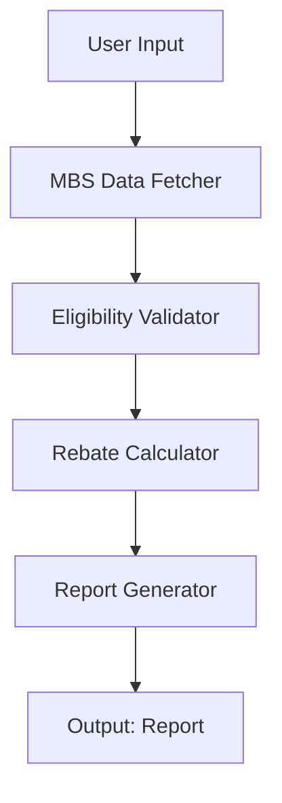

# Architecture

## Overview

The Medicare Rebate Eligibility Checker is built using a multi-agent architecture pattern. The system consists of four autonomous agents that collaborate to fetch data, validate eligibility, calculate rebates, and generate reports.

## Agent Workflow

## Agent Responsibilities

Each agent has a single, well-defined responsibility:

- **MBSDataFetcher**: Retrieves MBS item data from persistent storage, with caching and fallback mechanisms.
- **EligibilityValidator**: Applies complex Medicare eligibility rules using a rule engine.
- **RebateCalculator**: Performs precise financial calculations, handling after-hours multipliers and bulk billing adjustments.
- **ReportGenerator**: Produces formatted output in multiple formats (Markdown, JSON, HTML).

## Design Patterns

The system employs several enterprise design patterns:

- **Repository Pattern** for data access abstraction
- **Strategy Pattern** for pluggable validation and calculation logic
- **Template Method** for report generation
- **Circuit Breaker** for resilience in data fetching

## Quality Attributes

| Attribute | Implementation |
|-----------|----------------|
| **Modularity** | Loose coupling between agents via clear interfaces |
| **Testability** | Each agent can be tested in isolation |
| **Extensibility** | New agent types can be added with minimal impact |
| **Observability** | Structured logging and metric hooks throughout |
| **Security** | Input validation, rate limiting, no PII storage |